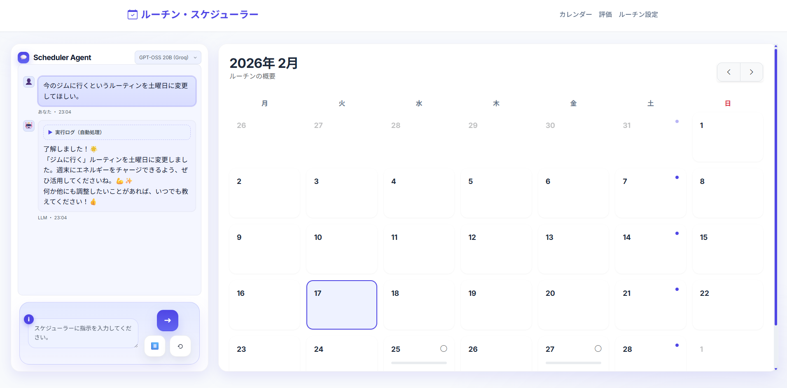

> 📝 一番下に日本語版もあります。

# Scheduler Agent 📅


## UI Preview

<p align="center">
  
</p>

## 🎬 Demo Videos

Click a thumbnail to open the video on YouTube.

| [](https://youtu.be/FNXvN0xkqtU) | [](https://youtu.be/pMmqIU1zab8) | [](https://youtu.be/SbBVq13BDxY) |
| --- | --- | --- |
| Schedule lunch for next Wednesday and Friday | Check next week's schedule, then create a gym routine for next Wednesday | Reschedule the gym routine to Saturday |

## Welcome

**Scheduler Agent** is an AI-powered scheduling assistant that helps you manage routines and one-off tasks through a simple chat experience. Ask things like “What’s on my calendar tomorrow?” or “Add groceries next Tuesday,” and the assistant keeps your timeline organized.

---

## 🚀 Quick start (Docker Compose only)

### 1) Prepare your API keys
Create a file named `secrets.env` in the project root and add the database settings plus at least one provider key.

```env
# secrets.env (example)
POSTGRES_PASSWORD=scheduler
POSTGRES_DB=scheduler
POSTGRES_USER=scheduler
DATABASE_URL=postgresql+psycopg2://scheduler:scheduler@db:5432/scheduler

OPENAI_API_KEY=sk-...
GEMINI_API_KEY=AIza...
ANTHROPIC_API_KEY=sk-ant-...
# Prompt guard (recommended)
GROQ_API_KEY=gsk_...
```

### 2) Start the app
Run Docker Compose from the project root:

```bash
docker network create multi_agent_platform_net
```

```bash
docker compose up --build
```

### 3) Open the app
Once the logs settle, open the app in your browser:

👉 http://localhost:5010

### 4) Stop the app
When you’re done, stop the containers:

```bash
docker compose down
```

---

## 📜 License

This project is released under the [MIT License](LICENSE.md).

---

<details>
<summary>日本語版（クリックして開く）</summary>

## 👋 はじめに

### UI Preview

<p align="center">
  
</p>

## 🎬 デモ動画

サムネイルをクリックするとYouTubeで開きます。

| [](https://youtu.be/FNXvN0xkqtU) | [](https://youtu.be/pMmqIU1zab8) | [](https://youtu.be/SbBVq13BDxY) |
| --- | --- | --- |
| 来週の水曜日と金曜日にランチの予定を入れる | 来週の予定を確認した後、来週水曜日にジムに行くルーティンを作成する | ジムに行くルーティンを土曜日に変更する |

**Scheduler Agent** は、チャットで予定やタスクを管理できるAIスケジュールアシスタントです。
「明日の予定は？」「来週火曜に買い物を追加して」など、話しかけるだけでタイムラインを整理できます。

---

## 🚀 すぐに始める（Docker Composeのみ）

### 1) APIキーの準備
プロジェクト直下に `secrets.env` を作成し、DB設定と少なくとも1つのキーを追加してください。

```env
# secrets.env の例
POSTGRES_PASSWORD=scheduler
POSTGRES_DB=scheduler
POSTGRES_USER=scheduler
DATABASE_URL=postgresql+psycopg2://scheduler:scheduler@db:5432/scheduler

OPENAI_API_KEY=sk-...
GEMINI_API_KEY=AIza...
ANTHROPIC_API_KEY=sk-ant-...
# プロンプトガード（推奨）
GROQ_API_KEY=gsk_...
```

### 2) 起動
プロジェクト直下で次のコマンドを実行します。

```bash
docker network create multi_agent_platform_net
```

```bash
docker compose up --build
```

### 3) ブラウザでアクセス
ログが落ち着いたら、以下へアクセスしてください。

👉 http://localhost:5010

### 4) 停止
終了するときは、次のコマンドで停止します。

```bash
docker compose down
```

---

## 📜 ライセンス

本プロジェクトは [MIT License](LICENSE.md) で公開されています。

</details>
